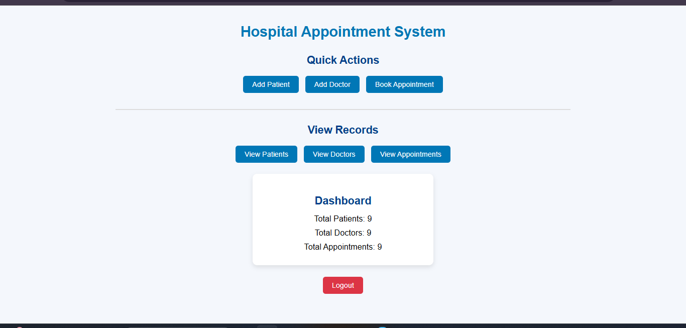
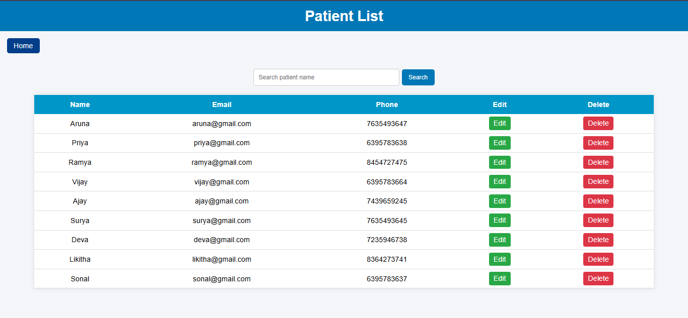
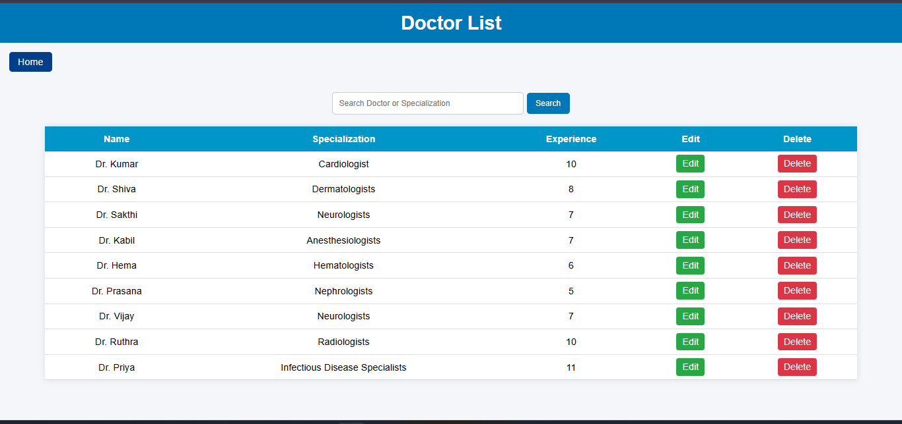
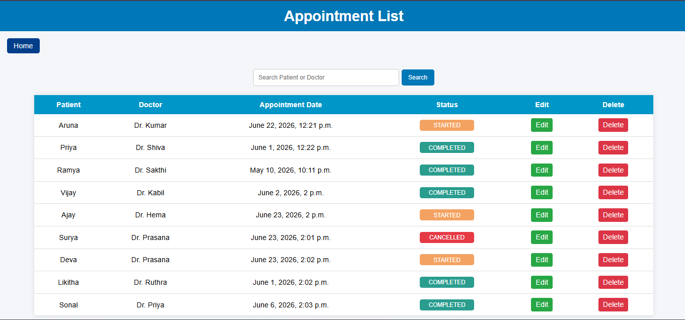

# Hospital Management System

A Django-based Hospital Management System that helps manage patients, doctors, and appointments efficiently. The application provides CRUD operations, appointment scheduling, status tracking, and search functionality through a user-friendly interface.

---

## Features

### Patient Management

* Add Patient
* View Patient List
* Edit Patient Details
* Delete Patient Records
* Search Patients

### Doctor Management

* Add Doctor
* View Doctor List
* Edit Doctor Details
* Delete Doctor Records
* Search Doctors

### Appointment Management

* Schedule Appointments
* View Appointment List
* Update Appointment Status
* Delete Appointments
* Search Appointments

---

## Technologies Used

* Python
* Django
* SQLite
* HTML
* CSS

---

## Screenshots

### Home Page



### Patient List



### Doctor List



### Appointment List



---

## Project Structure

```text
Hospital-Management-System/
│
├── hospitalapp/
├── hospitalproject/
├── home.png
├── patients.png
├── doctors.png
├── appointments.png
├── manage.py
├── README.md
└── .gitignore
```

---

## Installation

### Clone Repository

```bash
git clone https://github.com/arunaperumal2005-glitch/Hospital-Management-System.git
```

### Move to Project Directory

```bash
cd Hospital-Management-System
```

### Install Django

```bash
pip install django
```

### Apply Migrations

```bash
python manage.py migrate
```

### Run Server

```bash
python manage.py runserver
```

### Open Browser

```text
http://127.0.0.1:8000/
```

---

## Key Functionalities

* CRUD Operations using Django
* Patient Management
* Doctor Management
* Appointment Scheduling
* Appointment Status Tracking
* Search Functionality
* Responsive User Interface

---

## Future Enhancements

* User Authentication
* Online Appointment Booking
* Email Notifications
* Medical Records Management
* Dashboard and Reports
* MySQL Database Integration

---

## Author

**Aruna P**

B.Tech Information Technology

Python Full Stack Developer

GitHub: https://github.com/arunaperumal2005-glitch
